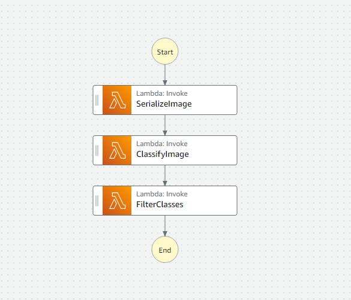
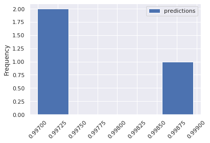
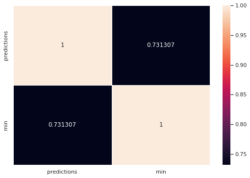

# Build a ML Workflow For Scones Unlimited On Amazon SageMaker

## Project Introduction

### Background

Image Classifiers are used in the field of computer vision to identify the content of an image and it is used across a broad variety of industries, from advanced technologies like autonomous vehicles and augmented reality, to eCommerce platforms, and even in diagnostic medicine.

You are hired as a Machine Learning Engineer for a scone-delivery-focused logistics company, Scones Unlimited, and you’re working to ship an Image Classification model. The image classification model can help the team in a variety of ways in their operating environment: detecting people and vehicles in video feeds from roadways, better support routing for their engagement on social media, detecting defects in their scones, and many more!

In this project, you'll be building an image classification model that can automatically detect which kind of vehicle delivery drivers have, in order to route them to the correct loading bay and orders. Assigning delivery professionals who have a bicycle to nearby orders and giving motorcyclists orders that are farther can help Scones Unlimited optimize their operations.

As an MLE, your goal is to ship a scalable and safe model. Once your model becomes available to other teams on-demand, it’s important that your model can scale to meet demand, and that safeguards are in place to monitor and control for drift or degraded performance.

In this project, you’ll use AWS Sagemaker to build an image classification model that can tell bicycles apart from motorcycles. You'll deploy your model, use AWS Lambda functions to build supporting services, and AWS Step Functions to compose your model and services into an event-driven application. At the end of this project, you will have created a portfolio-ready demo that showcases your ability to build and compose scalable, ML-enabled, AWS applications.

### The Dataset

We will use the [CIFAR-100](https://www.cs.toronto.edu/~kriz/cifar-100-python.tar.gz) dataset, it consists of 32x32 pixels from 100 different classes.

For more information, visit the [official site](https://www.cs.toronto.edu/~kriz/cifar.html).

### Running the notebook

### Step 1: Data staging

We encounter the download of the data inside the notebook, so do not worry to gather the information and download to the folder, is everything integrated.

The CIFAR-100 dataset is extracted in the first stage of the processs.

### Step 2: Model training and deployment

For this section we will use an 'ml.p2.xlarge' for training, but you could use another one for your selection. AWS will initialize services and actions for the machine until the training is finished.

The model later is deployed by the enpoint name 'image-classifier-ep'.  One thing to note is you must delete the enpoint because costs of an endpoint got over each hour.  So if you want to continue later, then you must delete the endpoint and create it again using the pretrained model, this is integrated in the notebook below the training process too.

Remember, if you will not use the endpoint more, then delete it.

###  Step 3.1: Lambdas

We will have several lambda funtions that make the workflow easy to follow and depurate bugs.

#### Lambda 1 - Serialize Image

This lambda file will ensure you to serialize the image before classifying.  Note that i cut the full image data because encoded is too long to display.

Input Example - Serialize Image

    {
      "inferences": [],
      "s3_key": "Udacity-AWSML-PRO2/test/bike_s_002116.png",
      "s3_bucket": "sagemaker-us-east-1-254050731868",
      "image_data": ""
    }

Output Example - Serialize Image

    {
     'statusCode': 200,
     'body': {'image_data': b'iVBORw0KGgoAAAANSUhEUgA...ggg==',
     's3_bucket': 'sagemaker-us-east-1-254050731868',
     's3_key': 'Udacity-AWSML-PRO2/test/bike_s_002116.png',
     'inferences': []}
    }

#### Lambda 2 - Classify Image

This lambda file will invoke the endpoint and get as result the inferences as is from the deployed model.

Input Example - Classify Image

    {
     'statusCode': 200,
     'body': {'image_data': b'iVBORw0KGgoAAAANSUhEUgA...ggg==',
     's3_bucket': 'sagemaker-us-east-1-254050731868',
     's3_key': 'Udacity-AWSML-PRO2/test/bike_s_002116.png',
     'inferences': []}
    }

Output Example - Classify Image

    {
     'statusCode': 200,
     'body': '{"inferences": [0.9969943761825562, 0.0030055944807827473]}'
    }

#### Lambda 3 - Filter Classes

This lambda file will get the predictions from the previous endpoint and stresses over a threshold to get a clean output if succeddded.  Our threshold is 0.93, but can be changed.

Input Example - Filter Classes

    {
     'statusCode': 200,
     'body': '{"inferences": [0.9969943761825562, 0.0030055944807827473]}'
    }

Output Example - Filter Classes

    {
      'statusCode': 200, 
      'body': {'inferences': [1.0, 0.0]}
    }

Step 4: Testing and evaluation

###  Step 3.2: Step Function Workflow

Step functions are orchestators.  They could be used for complex workflows and to manageb better the resources.  In this case we will keep it simple and did a simple invocation of lambdas.

#### Step 4 - Testing and Evaluation.

The final part of the project is the invocation of the step function using test data of the model.  It is implemented at the end of the notebook.

#### Step 5 - Visualizations

A good workflow gets visualizations!.  We also constructed two visualizations about the frequency of predictions and a correlation graph in seabors about the time and the classifications.

 <b>Contributing<b>

Your contributions are always welcome! Please feel free to fork and modify the content but remember to finally do a pull request.

 :iphone: <b>Having Problems?<b>

 

 <b>License<b>

